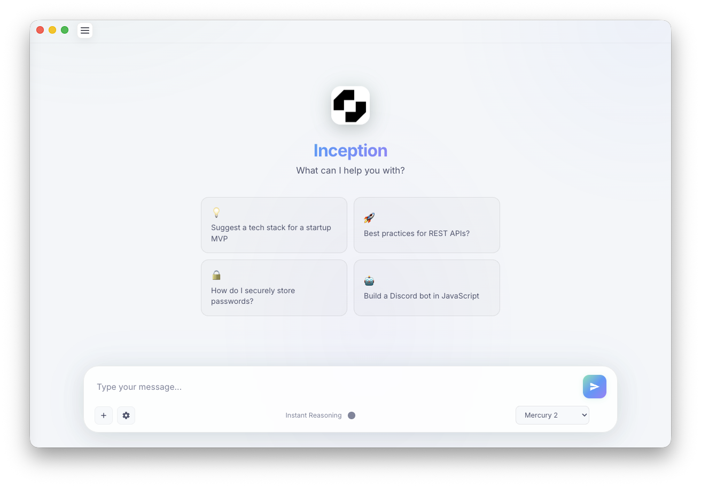

# Inception

A desktop chat application for [Inception Labs](https://inceptionlabs.ai) Mercury models, built with Electron.




## Features

- Chat with Mercury AI models via the Inception Labs API or OpenRouter
- Persistent conversation history stored locally with SQLite
- Recent chats sidebar for quick access to past conversations
- Reasoning mode toggle for Mercury 2
- Dark and light themes
- System tray support (macOS) — minimize to tray and stay running in the background
- Auto-update — checks GitHub Releases on startup and prompts to install new versions
- Syntax highlighting for code blocks
- Cross-platform: macOS, Windows, Linux

## Models

| Model | Description |
|---|---|
| Mercury 2 | General-purpose model |

## Getting Started

### Prerequisites

- [Node.js](https://nodejs.org) (v18+)
- An [Inception Labs API key](https://platform.inceptionlabs.ai/dashboard/api-keys)

### Installation

```bash
npm install
```

Native modules (better-sqlite3) are rebuilt automatically via the `postinstall` script.

### Running

```bash
# Production mode
npm start

# Development mode (opens DevTools)
npm run dev
```

### Configuration

On first launch, open Settings (⚙️) and enter your API key. Available providers:

| Provider | Setting |
|---|---|
| Inception Labs | API key from [platform.inceptionlabs.ai](https://platform.inceptionlabs.ai/dashboard/api-keys) |
| OpenRouter | API key from [openrouter.ai](https://openrouter.ai) |

Settings (theme, model, max tokens) are saved to the Electron userData directory.

## Building

```bash
# All platforms
npm run build

# macOS only
npm run build-mac

# Windows only
npm run build-win

# Linux only
npm run build-linux
```

Build output goes to `dist/`. Linux builds produce AppImage, .deb, and .rpm packages.

## Keyboard Shortcuts

| Shortcut | Action |
|---|---|
| `Cmd/Ctrl+N` | New chat |
| `Cmd+Q` / `Ctrl+Q` | Quit |

## License

MIT — © 2025 Tim Tully
